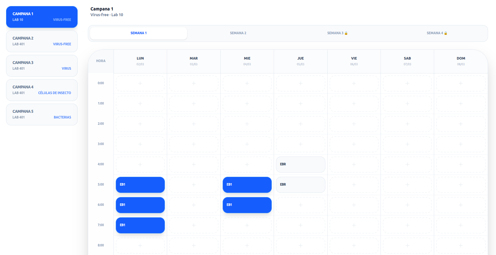
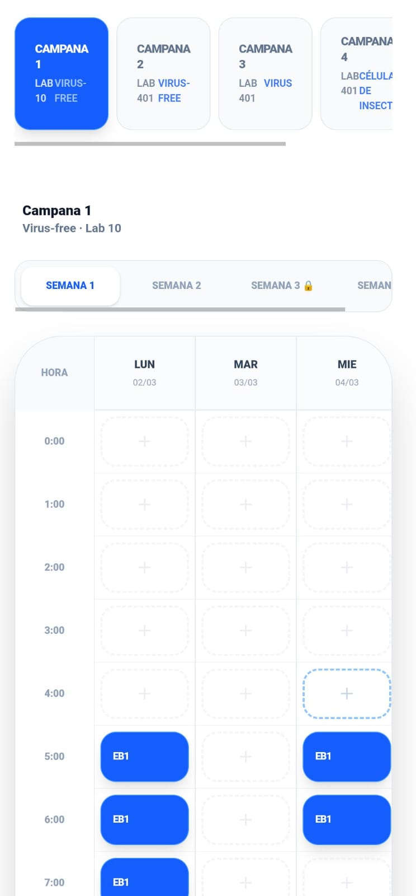

# CellBlock

> **CellBlock** is a professional-grade scheduling engine designed to coordinate the use of critical equipment in biotechnology and research environments. As part of the **HostCell** suite, it provides a high-performance, real-time booking interface optimized for the lab bench.

<a href="[https://github.com/ebalderasr/CellBlock](https://github.com/ebalderasr/CellBlock)">Repo</a> •
<a href="[https://ebalderasr.github.io/CellBlock/](https://ebalderasr.github.io/CellBlock/)">Live App</a>

---

## A Flexible & Customizable Framework

**CellBlock** is built to be an adaptable solution that can be tailored to the specific operational needs of any research group:

* **Unlimited Equipment Configuration**: Dynamically manage laminar flow hoods, bioreactors, microscopes, or any shared resource.
* **Custom Usage Policies**: Define specific time limits, booking windows, and access permissions for different user levels.
* **Adaptive Visuals**: The interface can be branded and adjusted to match the institutional identity of any laboratory.
* **Automated Workflow Logic**: Features an intelligent "sliding window" system to manage future schedule releases automatically.

---

## 📸 Application Interface

### Desktop View

Designed for comprehensive planning and administrative management.

### Mobile View

Optimized for rapid booking and quick checks directly at the lab station.

---

## 🔬 Implementation: Palomares-Ramírez Group (IBt-UNAM)

This instance is specifically customized for **GPR-Lab** at the **Institute of Biotechnology, UNAM**, managing five specialized work stations with distinct biosafety requirements:

* **Hood 1** ( Virus-free).
* **Hood 2** ( Virus-free).
* **Hood 3** ( Virus).
* **Hood 4** ( Insect Cells).
* **Bacteria Hood** (Lab 401 | Bacteria).

---

## ✅ Operational Logic & Rules

To ensure fair equipment distribution and efficient lab flow, the following rules are implemented:

### 1) The 3-Hour Limit

* Users are restricted to a maximum of **3 consecutive hours** per equipment in a single day.
* This prevents schedule saturation and ensures all group members have access to workspace.

### 2) 4-Week Sliding Window

The system operates on a rolling schedule with automated release triggers:

* **Weeks 1 & 2**: Always open for standard planning and passaging.
* **Weeks 3 & 4**: Locked for standard users and released automatically every **Saturday at 11:00 AM**.
* **Rollover**: Every Monday at 00:00, the schedule shifts; former weeks 3 and 4 become weeks 1 and 2, and new weeks are generated.

---

## ⚡ Technical Features

* **24/7 Scheduling**: Full grid support for night shifts and weekend monitoring.
* **Experiment Notes**: Real-time communication via booking notes (e.g., "Media change only", "Cleaning required").
* **PWA Ready**: Installable on Android, iOS, and PC as a standalone application.
* **Secure Access**: Managed through institutional email or unique 3-letter codes for quick ID.

---

## 🛠️ Technical Support

**CellBlock** is maintained by the lab's technical support:

* **Admin/Support**: Emiliano Balderas.
* **Contact**: [emiliano.balderas@ibt.unam.mx](mailto:emiliano.balderas@ibt.unam.mx).

---

**Host Cell Lab Suite** – *Practical tools for high-performance biotechnology.*
